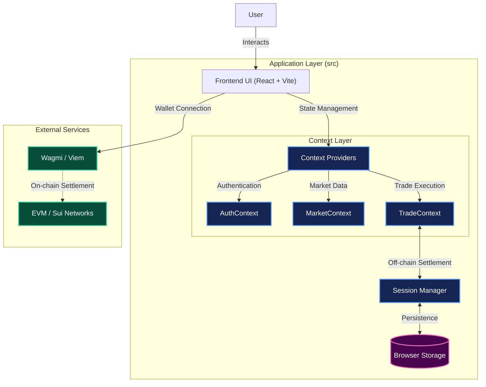

# ScoutX Dashboard

ScoutX is a decentralized opportunity market platform that enables users to scout and trade on the potential of early-stage startups, protocols, and artists. It leverages an off-chain session management system to provide a gasless, instant trading experience, aligning with state channel architectures like Yellow Network.

## Architecture

The application is built as a Single Page Application (SPA) using React and Vite, with a focus on local-first state management for immediate user feedback.

### System Overview



### Trading Data Flow

The following diagram illustrates the lifecycle of a trading session, from wallet connection to final on-chain settlement.

```mermaid
sequenceDiagram
    actor User
    participant UI as Frontend
    participant SM as Session Manager
    participant Chain as Blockchain

    User->>UI: Connect Wallet
    UI->>Chain: Verify Account

    rect rgb(23, 37, 84)
        note right of User: Session Start
        User->>UI: Deposit into Market
        UI->>SM: Open Session (Lock Funds)
        SM-->>UI: Session Active
    end

    rect rgb(74, 4, 78)
        note right of User: Off-Chain Trading
        loop Rapid Trading
            User->>UI: Place Trade (Buy YES)
            UI->>SM: Sign & Record Trade
            SM-->>UI: Update Position (Instant)
        end
    end

    rect rgb(6, 78, 59)
        note right of User: Settlement
        User->>UI: Close Session
        UI->>SM: Generate Settlement Hash
        SM-->>UI: Return Hash
        UI->>Chain: Commit Final State
        Chain-->>UI: Transaction Confirmed
    end
```



### Key Components

- **Frontend UI**: Built with React, TypeScript, and Tailwind CSS (using shadcn/ui components). Handles user interaction and visualization.
- **Session Manager (`backend/sessionManager.ts`)**: A local simulation of off-chain state channels. It manages:
  - **Session Opening**: Funding a channel (deposit).
  - **Trading**: Off-chain state transitions (gasless trades).
  - **Settlement**: Preparing final state hashes for on-chain commitment.
- **Context Layer**:
  - `MarketContext`: Manages market data and listings.
  - `TradeContext`: Orchestrates trading sessions and positions.
  - `AuthContext`: Handles user authentication and wallet connection status.

## Features

- **Opportunity Markets**: Create and trade on markets for VCs, DAOs, and Music Labels.
- **Gasless Trading**: Off-chain session management allows for instant trades without paying gas for every action.
- **Market Creation**: Users can sponsor new markets with custom parameters.
- **Portfolio Tracking**: Real-time tracking of active positions and trade history.
- **Self-Trading Prevention**: Built-in logic to prevent market creators from trading on their own markets to ensure fairness.

## Tech Stack

- **Framework**: [React](https://react.dev/) + [Vite](https://vitejs.dev/)
- **Language**: [TypeScript](https://www.typescriptlang.org/)
- **Styling**: [Tailwind CSS](https://tailwindcss.com/) + [shadcn/ui](https://ui.shadcn.com/)
- **State Management**: React Context + [TanStack Query](https://tanstack.com/query/latest)
- **Web3**: [Wagmi](https://wagmi.sh/) + [Viem](https://viem.sh/)
- **Icons**: [Lucide React](https://lucide.dev/)

## Getting Started

### Prerequisites

- Node.js (v18 or higher)
- npm or yarn

### Installation

1.  **Clone the repository**

    ```bash
    git clone <repository-url>
    cd scoutx-dashboard-main
    ```

2.  **Install dependencies**

    ```bash
    npm install
    ```

3.  **Start the development server**

    ```bash
    npm run dev
    ```

4.  **Open in Browser**
    Navigate to `http://localhost:8080` to view the application.

## Project Structure

```
scoutx-dashboard-main/
├── backend/            # Local session manager logic
├── contracts/          # Smart contracts (EVM/Sui)
├── src/
│   ├── components/     # Reusable UI components
│   ├── context/        # React Context providers (State)
│   ├── data/           # Mock data and interfaces
│   ├── pages/          # Application pages/views
│   ├── lib/            # Utilities and configurations
│   ├── App.tsx         # Main application component
│   └── main.tsx        # Entry point
└── public/             # Static assets
```
